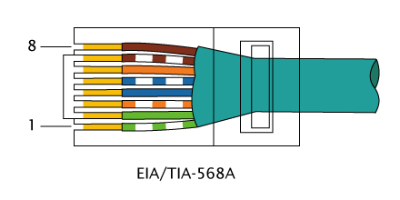
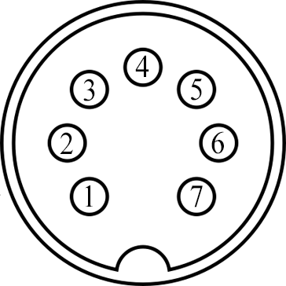

# AutoDesk

Automatic standing desk control using a Raspberry Pi.

## Design

The software consists of three components:

  * Session logger
  * Web server
  * Timer server

The web and timer servers run on the Pi and the session logger runs on the
workstation.

The session logger monitors DBus and notifies the web server over HTTP (wrap it
with SSH for security) of session activation and inactivation (lock/unlock)
events.

The web server maintains a database (SQLite) of desk (up/down) and session
(active/inactive) events. Every time an event occurs, the active time is
computed for the current desk state (that is how long have I been sitting or
standing). This time is compared against a fixed limit and the timer server is
notified about when the desk state should be changed next. The web server also
provides an API for manually forcing the desk to a desired state.

The timer server is communicated to over a named pipe with a dumb text
protocol. It maintains a timer (fixed delay) and what the next state should be.
The timer can be stopped and updated (shorter/longer delay or different next
state).

## Usage

### Hardware

Setup your Raspberry Pi with two relays circuits (you could probably use
transistors directly as the voltage and current are usually pretty low for the
control switches). Then setup the cables and connector as needed depending on
what your desk controller uses.

#### 8P8C jack (AKA RJ45 or Ethernet)

Some desk controllers uses 8P8C connectors, i.e. you can use a regular (RJ45)
ethernet cable, see image below. One of those desks uses blue, brown and white
like this:

```
  blue <-> blue/white => up
  blue <-> brown      => down
```



#### 7-pin DIN jack

Other desk controllers uses 7-pin DIN connectors, see image below. One of those
desks uses pins 1, 2 and three like this:

```
  1 <-> 2 => up
  1 <-> 3 => down
```



### Software

Setup a user and install the software:

    sudo useradd -d /var/local/autodesk -r -s /usr/bin/nologin autodesk
    sudo cp sys/nginx.conf /etc/nginx.conf
    sudo cp sys/autodesk-{uwsgi,timer}.service /etc/systemd/system
    sudo -u autodesk virtualenv /var/local/autodesk/venv
    sudo -u autodesk /var/local/autodesk/venv/bin/pip install /path/to/autodesk uwsgi
    sudo -u autodesk mkfifo /var/local/autodesk/timer
    sudo -u autodesk openssl req -x509 -nodes -days 365 -newkey rsa:4096 -keyout /var/local/autodesk/certs/autodesk.key -out /var/local/autodesk/certs/autodesk.crt
    sudo -u autodesk openssl dhparam -out /var/local/certs/dhparam.pem 4096
    sudo -u autodesk htpasswd -c /var/local/autodesk/htpasswd admin

Add a configuration in `/var/local/autodesk/settings.cfg` (pins are in
`GPIO.BOARD` mode, limit times are in minutes):

    DELAY = 15
    PIN_DOWN = 15
    PIN_UP = 13
    LIMIT_DOWN = 50
    LIMIT_UP = 10
    DATABASE = '/var/local/autodesk/desk.db'
    TIMER_PATH = '/var/local/autodesk/timer'

Finally start the services:

    sudo systemctl enable --now autodesk-{uwsgi,timer}.service nginx.service

### Desktop Software

Run the `logger.py` script to listen for lock/unlock events via DBus.

    logger.py https://autodesk/api/session

## TODO

* Configurable desk heights, now it justs goes up and down for 15 seconds which
  is the time it takes to reach bottom and up with my desk.
